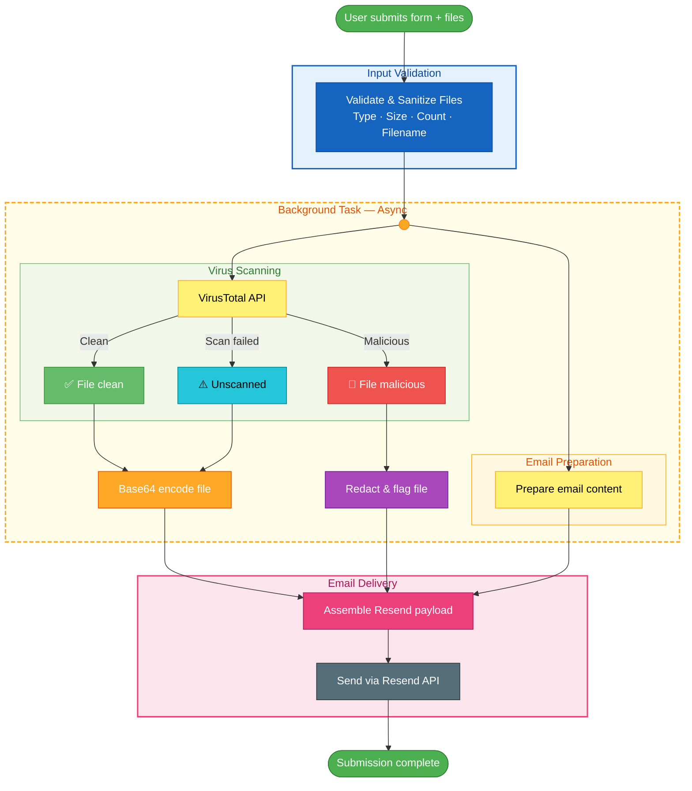

# Secure File Submission API (FastAPI + VirusTotal + Resend)

This project is a **secure file submission backend** built with **FastAPI**.  
It allows users to submit a form with attachments that are automatically scanned for viruses using **VirusTotal**, then emailed to an admin using **Resend**.

The goal of this API is to safely handle file uploads, prevent malicious file submissions, and automate the notification process — all asynchronously.

For context, this was developed for a construction company's website quote request submission form.

---

## Features

- Secure file upload with MIME, extension, and size validation  
- Asynchronous VirusTotal scanning using `asyncio`
- Email notifications (via Resend API)  
- Background tasks for non-blocking performance  
- API key authentication (`x-api-key`)
- CORS support for frontend integration  
- Docker-ready for easy deployment  

---

## How It Works

1. A user submits a form (from a web frontend) with text fields and up to **3 file attachments**.
2. The API:
   - Validates the file type, size, and extension.
   - Scans each file with **VirusTotal** in the background.
   - Sends the clean (and unscanned) files — Base64 encoded — to an admin via **email** using Resend.
   - Redacts any file flagged as malicious.
3. The response returns instantly, while scanning and emailing continue in the background.



---

## Tech Stack

- **Framework:** FastAPI  
- **Security & Validation:** `python-magic`, `werkzeug`  
- **Scanning:** VirusTotal Python SDK  
- **Email Service:** Resend Python SDK  
- **Async Processing:** `asyncio` + `BackgroundTasks`  
- **Environment Management:** `python-dotenv`  
- **Deployment:** Docker / Railway

---

## Setup & Installation

### 1️. Clone the Repository

```bash
git clone https://github.com/A2p3kt/fastapi-vt-mail.git
cd fastapi-vt-mail
```

### 2. Create a Virtual Environment

```bash
python -m venv venv
source venv/bin/activate   # On macOS/Linux
venv\Scripts\activate      # On Windows
```

### 3. Install Dependencies

```bash
pip install -r requirements.txt
```

### 4. Create a `.env` File

Create a `.env` file in the project root with the following variables:

```env
VT_API_KEY=your_virustotal_api_key
RESEND_API_KEY=re_your_resend_api_key
FAST_API_KEY=your_custom_api_key
ALLOWED_ORIGIN=https://yourfrontenddomain.com
MAIL_FROM=onboarding@resend.dev
MAIL_FROM_NAME=Secure API Bot
RECIPIENT_EMAIL=admin@example.com
```

> [!IMPORTANT]
>
> You come up with `FAST_API_KEY` yourself

> [!NOTE]
>
> If you are using a Resend Sandbox account without a custom domain, you must use `onboarding@resend.dev` as your `MAIL_FROM` and your own signup email as the `RECIPIENT_EMAIL`.

> [!WARNING]
>
> The `.env` file should never be committed to GitHub

### 5. Run the API Server

```bash
uvicorn main:app --reload
```

Now open your browser at <http://127.0.0.1:8000/docs> to access the interactive Swagger UI.

---

## Running with Docker

### 1. Build the Docker Image

```bash
docker build -t fastapi-vt-mail .
```

### 2. Run the Container

```bash
docker run -d -p 8000:8000 --env-file .env fastapi-vt-mail
```

The API is now accessible at <http://localhost:8000>

---

## API Authentication

Every request must include an API key header:

```makefile
x-api-key: your_secret_api_key
```

If the key doesn't match `FAST_API_KEY` in your `.env`, the request will be rejected with:

```json
{
  "detail": "Unauthorized Call"
}
```

---

## API Endpoint

`POST /submit-form`

Handles customer form submissions and file uploads.

**Headers**:

```makefile
x-api-key: your_secret_api_key
```

**Form Data Fields**:

| Field        | Type     | Required | Description              |
|:-------------|:--------:|:--------:|:-------------------------|
| name         | string   | ✅       | Customer name            |
| email        | string   | ✅       | Customer email           |
| phone        | string   | ✅       | Phone number             |
| material     | string   | ✅       | Material description     |
| quantity     | string   | ✅       | Requested quantity       |
| blueprints   | file[]   | Optional | Up to 3 files (PDF, JPEG, PNG, STEP) |

**Response Example**:

✅ **Success Response (200 OK)**

This response is sent immediately to the client. The email and scan will be processed in the background.

```json
{
  "message": "Form submitted successfully. Files are being scanned and email will be sent shortly."
}
```

❌ **Error Responses**

- **400 Bad Request (Invalid File Type)**:

    ```json
    { "detail": "Invalid file type: application/x-dosexec" }
    ```

- **400 Bad Request (File Too Large)**:

    ```json
    { "detail": "file.pdf is bigger than expected: Max size = 10MB" }
    ```

- **400 Bad Request (Too Many Files)**:

    ```json
    { "detail": "Maximum of 3 files allowed" }
    ```

- **403 Forbidden (Invalid API Key)**:

    ```json
    { "detail": "Unauthorized Call" }
    ```

---

## VirusTotal Scanning Logic

Each file is uploaded to VirusTotal asynchronously.

> [!NOTE]
>
> Clean files are Base64 encoded and attached to the email.

> [!WARNING]
>
> Unscanned files (e.g., API issues) are Base64 encoded and attached but flagged.

> [!CAUTION]
>
> Malicious files are redacted and excluded from the email.

---

## Resend Email Logic

Unlike traditional SMTP services, Resend's API handles attachments by receiving a Base64 encoded string of the file content.

```python
# Prepare attachments for Resend
attachments = []
for f in clean_attachments:
    encoded_content = base64.b64encode(f["file_content"]).decode("utf-8")
    attachments.append({
        "content": encoded_content,
        "filename": f["filename"]
    })
```

---

## Email Notification Format

The admin email includes:

- Customer details
- Description
- Safe attachments (Base64 encoded)
- Notes on redacted or unscanned files

Example snippet in email:

```html
🚨 ATTENTION: The following file(s) were REDACTED due to a failed VirusTotal scan.
⚠️ The following file(s) could not be scanned due to a connectivity issue.
```

---

## Validation Rules

| Validation       | Description                              |
|:-----------------|:-----------------------------------------|
| File Count       | Max 3 files                              |
| File Size        | ≤ 10 MB per file                         |
| MIME Types       | PDF, PNG, JPEG, STEP                     |
| Signature Check  | Verified via `python-magic`              |
| Filename         | Sanitized with UUID and timestamp        |
| Auth Header      | Validated via `x-api-key`                |

---

## Deployment Tips

- Host on Railway, Render, or Fly.io.
- Ensure your Resend sender domain is verified before sending emails so that mails don't end up in the spam folder.
- If using Resend's sandbox (no custom domain), use `onboarding@resend.dev` as `MAIL_FROM`.

---

## Future Improvements

- Add rate limiting to protect API endpoints
- Improve error handling for email delivery and file scanning failures

---

## License

This project is licensed under the GNU General Public License, feel free to fork and improve it.  
See the [LICENSE](LICENSE) file for details.
